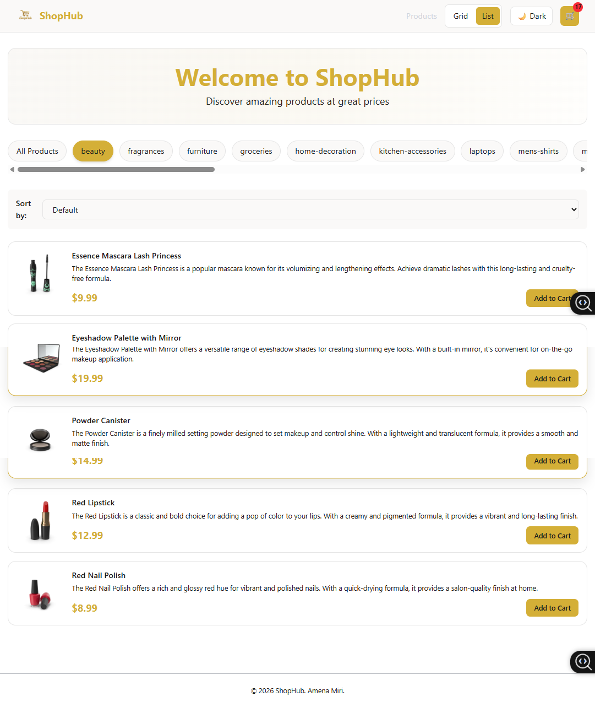
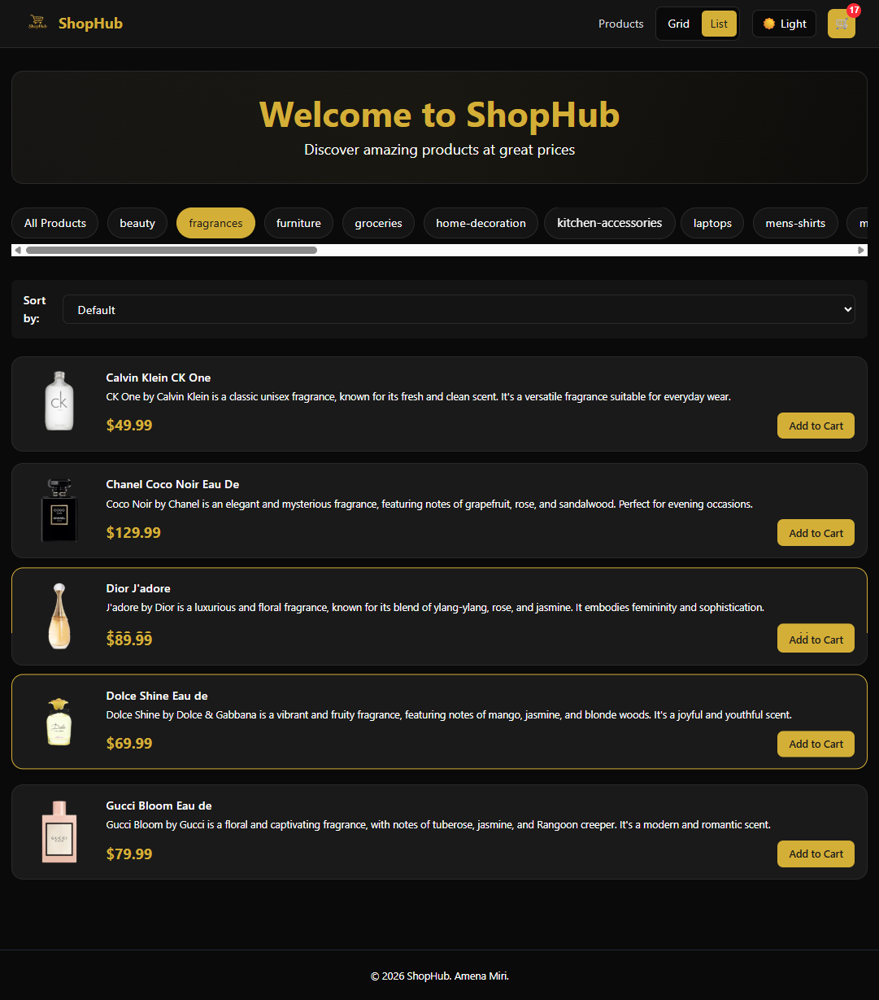
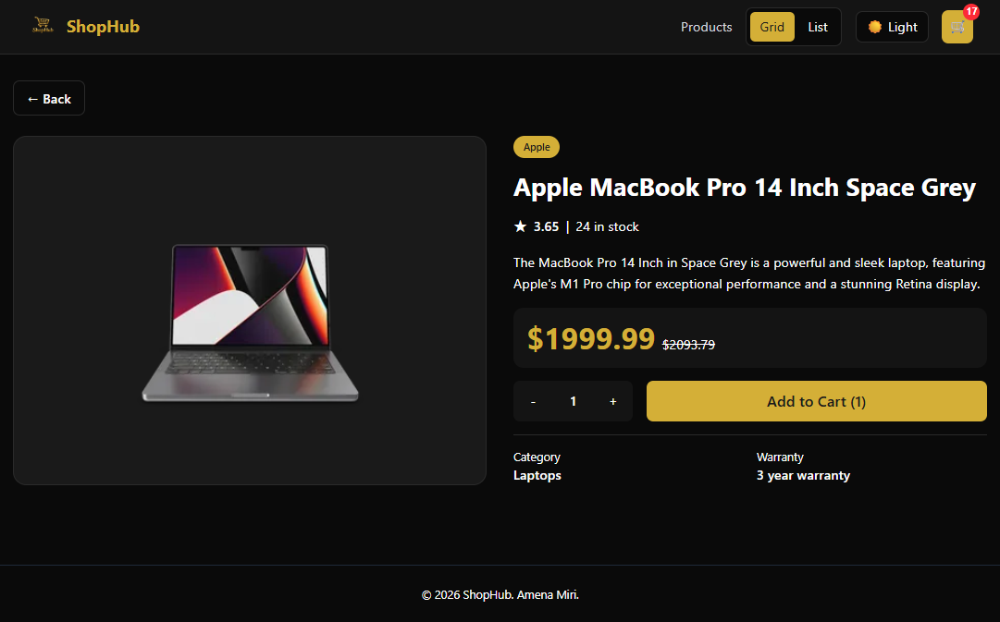
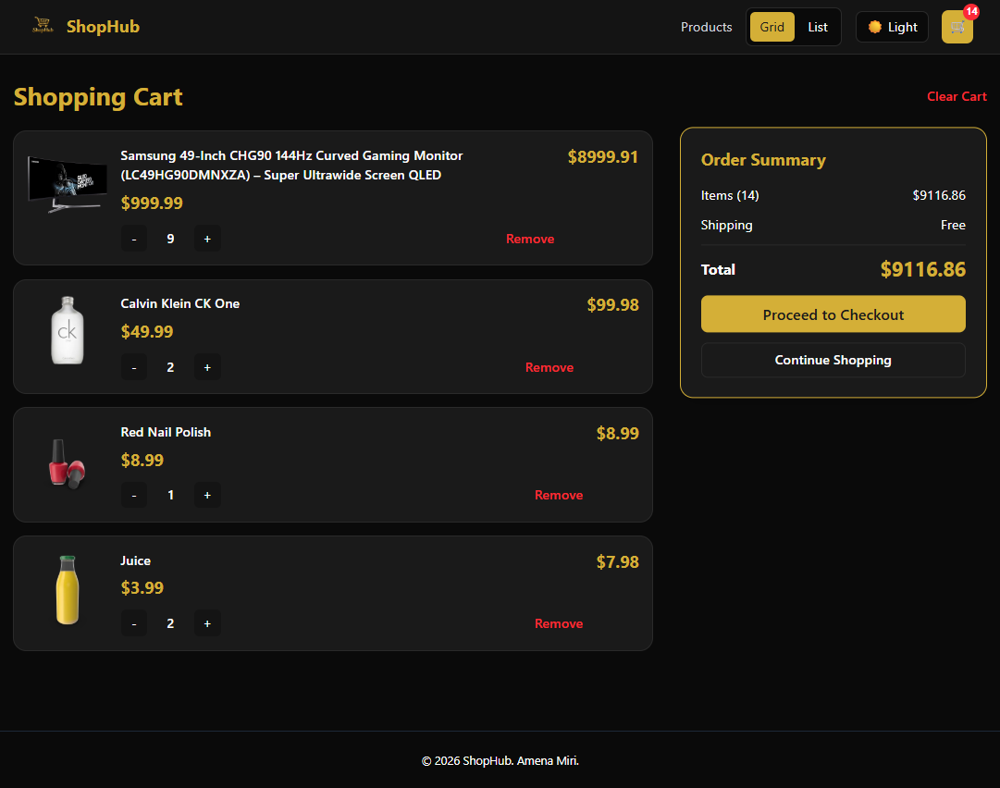
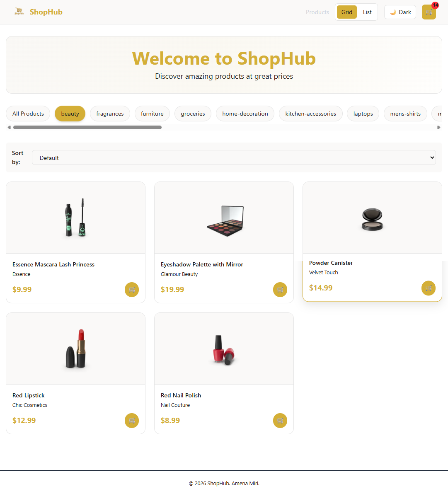
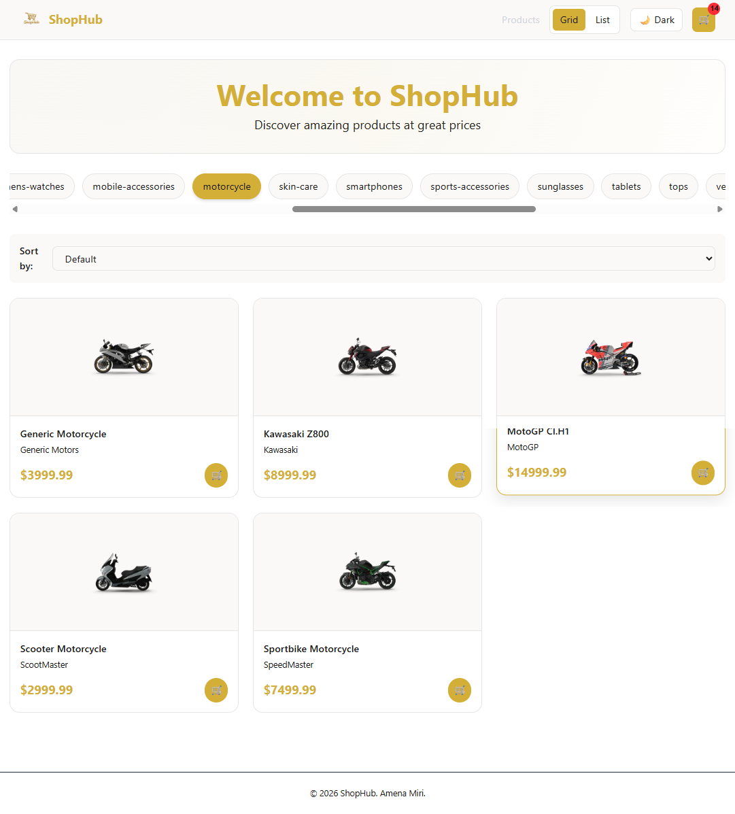
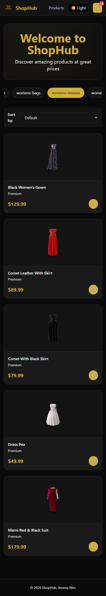

# 🛍️ ShopHub - Product Store App

> A csmall Product Store App built with React using Context API, Redux Toolkit, and React Query


---

## 📖 About The Project

ShopHub is a modern shopping application that demonstrates different state management approaches:

- **Context API + useReducer** → App settings (theme, view mode)
- **Redux Toolkit** → Shopping cart management
- **React Query** → Product data fetching & caching

---

## ✨ Features

| Feature | Description |
|---------|-------------|
| 🛒 Shopping Cart | Add, remove, update quantity, clear cart |
| 🌓 Dark/Light Theme | Toggle between themes with gold accent |
| 📱 Grid/List View | Switch between product display layouts |
| 🔍 Category Filter | Filter products by category |
| 📊 Price Sort | Sort products by price (low/high) |
| 💾 LocalStorage | Save cart and theme preferences |
| 📱 Responsive | Works on all devices |
| 🔔 Notifications | Toast messages for actions |

---

## 🛠️ Tech Stack

```javascript
{
  "frontend": "React 18 + Vite",
  "state": "Redux Toolkit + Context API",
  "dataFetching": "React Query + Axios",
  "styling": "TailwindCSS 4",
  "router": "React Router DOM",
  "notifications": "React Hot Toast"
}
```

---

## 📁 Project Structure

```txt
ShopHub/
│
├── src/
│   ├── api/
│   │   └── productsApi.js
│   │
│   ├── assets/
│   │   └── logo.png
│   │
│   ├── components/
│   │   ├── Navbar.jsx
│   │   ├── ProductCard.jsx
│   │   ├── ProductList.jsx
│   │   ├── Cart.jsx
│   │   ├── ProductDetails.jsx
│   │   ├── CategoryList.jsx
│   │   └── LoadingSpinner.jsx
│   │
│   ├── context/
│   │   ├── AppContext.jsx
│   │   └── AppReducer.js
│   │
│   ├── redux/
│   │   ├── store.js
│   │   └── cartSlice.js
│   │
│   ├── hooks/
│   │   └── useProducts.js
│   │
│   ├── pages/
│   │   └── HomePage.jsx
│   │
│   ├── App.jsx
│   ├── main.jsx
│   └── index.css
│
├── screenshots/
│   ├── home-light.png
│   ├── home-dark.png
│   ├── product-details.png
│   ├── cart.png
│   ├── categories.png
│   ├── view-toggle.png
│   └── mobile.png
│
├── .gitignore
├── index.html
├── package.json
├── vite.config.js
├── README.md
└── LICENSE
```

---

## 📊 State Management

| State Type | Tool Used | Why |
|------------|-----------|-----|
| Theme, View Mode | Context API + useReducer | Simple global state |
| Shopping Cart | Redux Toolkit | Complex state with many actions |
| Products Data | React Query | Server caching needs |

---

## 🎨 Color Palette

| Theme | Background | Text | Accent |
|------|------------|------|--------|
| Light | White (#fff) | Black (#1a1a1a) | Gold (#d4af37) |
| Dark  | Black (#0a0a0a) | White (#fff) | Gold (#d4af37) |

---

## 📸 Screenshots

### Home Page - Light Theme

*Main product listing page with light theme and grid layout*

### Home Page - Dark Theme

*Main product listing page with dark theme and gold accents*

### Product Details Page

*Detailed product view with quantity selector and specifications*

### Shopping Cart

*Shopping cart management with order summary*

### Category Filtering

*Product filtering by categories*

### Grid vs List View

*Toggle between grid and list product displays*

### Mobile Responsive View

*Fully responsive design for all devices*

---

## ⚙️ Installation & Run

```bash
git clone <repo-url>
cd ShopHub
npm install
npm install react-redux @reduxjs/toolkit @tanstack/react-query axios react-router-dom react-hot-toast
npm install tailwindcss @tailwindcss/vite
npm run dev

```

---

## 👨‍💻 Author

**Amena Miri**  
GitHub: [@Amena-Miri](https://github.com/Amena-Miri)
---

## 🙏 Credits

- DummyJSON for free API  
- React documentation  
- TailwindCSS for styling  

---

<div align="center">

⭐ Star this repo if you like it! ⭐  
Made with ❤️ using React  

</div>